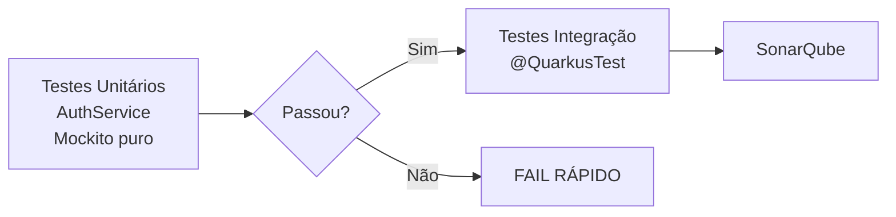

# 🔐 Feature: Auth — Plano de Ação

## Análise de Testabilidade

### Estrutura Atual
```
auth/
├── AuthController.java     # REST endpoints
├── AuthService.java        # Lógica de negócio (SEM interface)
├── JWTService.java         # Geração/validação de JWT (SEM interface)
├── PasswordEncoder.java    # Hash/verificação BCrypt (SEM interface)
├── AuthenticationFilter.java # Filtro JWT (field injection, exceção documentada)
├── GlobalExceptionMapper.java
├── JwtExceptionMapper.java
└── exceptions/
    ├── JwtAuthenticationException.java
    ├── TokenExpiredException.java
    ├── TokenInvalidException.java
    ├── TokenMalformedException.java
    └── TokenMissingException.java
```

### Más Práticas Identificadas

#### 🔴 1. Services sem interfaces (acoplamento direto)
**Severidade:** Média | **Impacto:** Testabilidade reduzida

`AuthService`, `JWTService`, `PasswordEncoder` não têm interfaces. Embora Quarkus com CDI permita mockar classes concretas via `@InjectMock`, a ausência de contratos:
- Dificulta a substituição em testes de integração
- Impede polimorfismo futuro (ex: múltiplos providers de autenticação)
- Viola princípio DIP (Dependency Inversion Principle)

**Solução pragmática:** Extrair interfaces apenas para classes que:
1. São mockadas em testes (AuthService, JWTService)
2. Têm potencial de múltiplas implementações (PasswordEncoder)

#### 🔴 2. Chamadas estáticas Panache em AuthService
**Severidade:** Alta | **Impacto:** Impossibilidade de mock unitário

```java
// AuthService.java - Linhas problemáticas:
UserModel existingUser = UserModel.findByEmail(request.getEmail());  // L53
UserModel user = UserModel.findByEmail(request.getEmail().toLowerCase().trim());  // L97
UserModel user = UserModel.findByOAuth(...);  // L150
```

- `UserModel.findByEmail()` é chamada estática do PanacheEntity
- Impossível mockar sem `@QuarkusTest` ou PowerMock
- Força testes de integração pesados para testar lógica de registro

**Solução:** Extrair um `UserRepository` injetável e usá-lo no AuthService.

#### 🟡 3. Tratamento de erro inconsistente no Controller
**Severidade:** Baixa | **Impacto:** Manutenibilidade

```java
// AuthController.java - catch genérico
catch (Exception e) {
    log.error("❌ Erro ao registrar usuário", e);
    return Response.status(Status.INTERNAL_SERVER_ERROR)
        .entity(Map.of("error", "Erro ao processar registro"))
        .build();
}
```

- `try/catch` genérico com `INTERNAL_SERVER_ERROR` mascara erros reais
- Duplicado em 3 endpoints (register, login, loginWithGoogle)

#### 🟡 4. Lógica de YouTube em AuthService
**Severidade:** Baixa | **Impacto:** Coesão

```java
private void updateYoutubeData(UserModel user, GoogleOAuthRequest request) {
    // Lógica específica de YouTube dentro de AuthService
}
```

Mistura responsabilidade de autenticação com atualização de dados de perfil. Responsabilidade do UserService.

---

## 🔧 Plano de Refatoração

### Passo 1: Extrair Interfaces (2h)

```java
// NOVO: br.com/aguideptbr/features/auth/AuthServiceInterface.java (ou manter apenas o contrato)
public interface AuthServiceInterface {
    LoginResponse register(RegisterRequest request);
    LoginResponse login(LoginRequest request);
    LoginResponse loginWithGoogle(GoogleOAuthRequest request);
}
```

```java
public interface JWTServiceInterface {
    String generateToken(UserModel user);
    Long getExpirationTime();
    boolean validateToken(String token);
}

public interface PasswordEncoderInterface {
    String hashPassword(String plainPassword);
    boolean verifyPassword(String plainPassword, String hashedPassword);
}
```

**Nota:** Se optar por não criar interfaces (estilo Quarkus padrão), ao menos garantir que `@InjectMock` funciona nos testes existentes.

### Passo 2: Extrair UserRepository (3h)

```java
// NOVO: br.com/aguideptbr/features/user/UserRepository.java
@ApplicationScoped
public class UserRepository implements PanacheRepositoryBase<UserModel, UUID> {
    public UserModel findByEmail(String email) { ... }
    public UserModel findByOAuth(String provider, String oauthId) { ... }
    public UserModel findByIdActive(UUID id) { ... }
}
```

**Impacto:** Substituir todas as chamadas `UserModel.findByX()` em Services.

### Passo 3: Mover updateYoutubeData para UserService (30min)

Criar método em UserService e injetar no AuthService.

### Passo 4: Centralizar Exception Handling (1h)

Criar ou melhorar o `GlobalExceptionMapper` para capturar:
- `WebApplicationException` → status code do erro
- `ConstraintViolationException` → 400
- `ValidationException` → 400
- Genéricas → 500

---

## 🧪 Estratégia de Testes

### Testes Unitários (com mocks)

| Classe | O que testar | Mocks necessários |
|--------|-------------|-------------------|
| AuthService | register() com email duplicado → CONFLICT | UserRepository, JWTService, PasswordEncoder |
| AuthService | login() com credenciais válidas → token | UserRepository, JWTService, PasswordEncoder |
| AuthService | login() com OAuth tentando senha → BAD_REQUEST | UserRepository |
| AuthService | loginWithGoogle() criando usuário novo | UserRepository, JWTService |
| AuthService | loginWithGoogle() usuário existente | UserRepository, JWTService |
| JWTService | generateToken() → token não-nulo | — (teste integração real) |
| PasswordEncoder | hashPassword() → hash BCrypt | — (teste integração real) |
| PasswordEncoder | verifyPassword() → true/false | — (teste integração real) |

### Testes de Integração (@QuarkusTest)

| Teste | Descrição |
|-------|-----------|
| AuthResourceOAuthTest | Fluxo completo OAuth Google (já existe) |
| RegisterRequestTest | Validação de @Valid constraints (já existe) |
| AuthServiceTest | Persistência de usuários (já existe) |
| JWTServiceTest | Geração e validação de tokens (já existe) |
| PasswordEncoderTest | Hash e verificação BCrypt (já existe) |

### Testes de Regressão

- **Cenário:** Registrar usuário → login → acessar `/me`
- **Cenário:** Registrar email duplicado → 409
- **Cenário:** Login com senha errada → 401
- **Cenário:** OAuth Google fluxo completo
- **Cenário:** Token expirado → 401

---

## 📊 Impacto na Pipeline

**Nenhum impacto esperado.** Os testes existentes continuam funcionando. A refatoração adiciona novos testes unitários que rodam sem banco de dados, acelerando a pipeline.



---

## ✅ Checklist de Implementação

- [ ] Criar interfaces: `AuthServiceInterface`, `JWTServiceInterface`, `PasswordEncoderInterface`
- [ ] Extrair `UserRepository` para chamadas find/query de UserModel
- [ ] Substituir `UserModel.findByEmail()` → `userRepository.findByEmail()`
- [ ] Substituir `UserModel.findByOAuth()` → `userRepository.findByOAuth()`
- [ ] Mover `updateYoutubeData()` para UserService
- [ ] Escrever testes unitários para AuthService com mocks
- [ ] Verificar se testes de integração existentes ainda passam
- [ ] Rodar `./mvnw verify` completo
