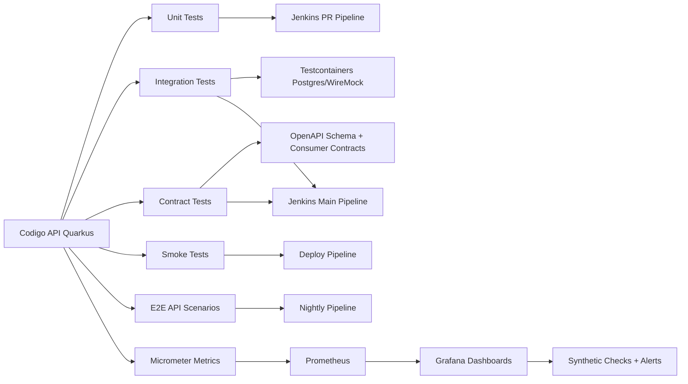

# FASE 2 - Proposta de Evolucao Tecnica (Framework de Testes + Qualidade + Observabilidade)

Data: 2026-07-29
Escopo: proposta tecnica pratica, incremental e sem over engineering, baseada no diagnostico da FASE 1.

---

## 1) Arquitetura ideal de um framework personalizado de testes para esta API

Objetivo: criar um framework de testes interno (no proprio repositorio) com foco em confiabilidade, velocidade e manutencao por equipe pequena/media.

Principios:
- Priorizar simplicidade operacional.
- Isolar tipos de teste por responsabilidade.
- Manter feedback rapido para dev local e PR.
- Executar testes mais caros apenas onde agregam valor.
- Tratar observabilidade como complemento de operacao, nao substituto de teste funcional.

Arquitetura proposta (visao logica):

Resultado esperado:
- Rapidez no dia a dia (unit + subset integracao).
- Alta confianca em release (integracao + contrato + smoke).
- Menor flakiness e menor custo de manutencao.

---

## 2) Ferramentas e bibliotecas (com justificativa)

Stack recomendada (open source, self-hosted friendly):

1. JUnit 5
- Base padrao Java moderna.
- Excelente suporte Quarkus e ecossistema Maven/Surefire.
- Facil composicao com extensoes.

2. REST Assured
- Muito bom para validar REST API (status, payload, headers, auth, schema).
- DSL legivel para equipe backend Java.
- Ja presente no projeto, reduz atrito de adocao.

3. Mockito
- Bom para unit tests isolados de servicos.
- Rapido, simples, consolidado.

4. Testcontainers
- Sobe dependencias reais (Postgres, WireMock) para testes de integracao reprodutiveis.
- Evita dependencia de ambiente compartilhado/manual.
- Funciona bem em Jenkins self-hosted com Docker.

5. WireMock
- Mock de APIs externas com comportamento HTTP realista.
- Bom para contratos de integracao externa sem chamar ambiente real.

6. AssertJ (opcional)
- Assertions mais expressivas para casos complexos.
- Pode ser adotado gradualmente (sem migracao big bang).

7. JSON Schema Validator (REST Assured plugin ou networknt json-schema-validator)
- Garante contrato minimo de payloads sem snapshots frageis.

8. Awaitility (opcional, para fluxos async)
- Esperas deterministicas com timeout/poll interval.
- Evita sleeps fixos e flakiness.

9. JaCoCo
- Ja em uso; manter para cobertura de codigo.

10. SonarQube Community (self-hosted)
- Ja operacional.
- Usar para quality gate e trend de qualidade.

11. Micrometer + Prometheus + Grafana
- Observabilidade minima util: latencia, taxa de erro, throughput, p95/p99.
- Totalmente self-hosted.

---

## 3) Priorizacao open source e self hosted

Prioridade A (implementar primeiro):
- JUnit 5
- REST Assured
- Mockito
- Testcontainers
- WireMock
- JaCoCo
- SonarQube (gate real)

Prioridade B (quando fizer sentido):
- AssertJ
- Awaitility
- Pact (se houver multiplos consumidores com contratos sensiveis)
- k6 para carga basica (self-hosted runner)

Prioridade C (apenas se necessidade real aparecer):
- Cucumber/BDD completo
- Tracing distribuido completo (Tempo/Jaeger) antes de maturidade basica de metricas

---

## 4) Comparacoes praticas

### REST Assured vs alternativas

REST Assured:
- Pros: DSL madura para Java, valida bem payload/header/auth/schema.
- Contras: para cenarios extremamente simples, pode parecer "mais pesado" que HTTP client puro.

Alternativas:
- WebTestClient (mais comum Spring stack).
- Karate: bom para API testing, mas adiciona linguagem/framework paralelo.

Decisao para este projeto:
- Manter REST Assured como padrao principal.

### JUnit 5 vs alternativas

JUnit 5:
- Pros: padrao do ecossistema Java, extensivel, integrado ao Quarkus.
- Contras: nenhum impeditivo relevante aqui.

TestNG:
- Bom, mas menor alinhamento com stack atual e sem ganho claro.

Decisao:
- Permanecer em JUnit 5.

### WireMock vs mocks internos manuais

WireMock:
- Pros: mock HTTP realista, stubs reutilizaveis, validacao de requests.
- Contras: pequena curva adicional.

Mocks internos (Mockito puro):
- Pros: simples para teste unitario.
- Contras: nao simula camada HTTP real externa.

Decisao:
- Mockito para unitario.
- WireMock para integracao com terceiros.

### Cucumber (BDD) com ou sem necessidade real

Com Cucumber:
- Pros: linguagem Gherkin legivel por negocio/QA.
- Contras: custo de manutencao alto se time nao usa BDD de verdade.

Sem Cucumber (cenarios em JUnit + nomenclatura clara):
- Pros: menor complexidade, mais velocidade.
- Contras: menos visibilidade para nao-tecnicos.

Decisao pragmatica:
- Nao adotar Cucumber agora.
- Reavaliar apenas se houver demanda real de colaboracao negocio-QA por cenarios executaveis.

---

## 5) Quando BDD faz sentido e quando complica

BDD faz sentido quando:
- Product/negocio participa ativamente da escrita e revisao de cenarios.
- Regras de negocio sao complexas e mudam com frequencia.
- Ha necessidade de rastreabilidade requisito -> cenario -> execucao.

BDD complica quando:
- Cenarios sao escritos apenas por dev/QA sem uso real pelo negocio.
- Time pequeno precisa priorizar entrega e estabilidade.
- Suite fica duplicada (teste tecnico + Gherkin equivalente).

Recomendacao atual:
- Usar estilo "BDD-lite" (given/when/then no nome dos testes), sem framework BDD completo por enquanto.

---

## 6) Separacao: unitario, integracao, contrato, regressao, smoke, e2e

Modelo proposto:

1. Unitarios
- Escopo: regra de negocio isolada.
- Dependencias: mocks/stubs, sem banco real.
- Tempo alvo: muito rapido.

2. Integracao
- Escopo: API + persistencia + serializacao + seguranca essencial.
- Dependencias: Postgres real via Testcontainers (ou perfil controlado).
- Cobertura: happy path + principais erro/edge.

3. Contrato
- Escopo: compatibilidade de schema e campos obrigatorios entre produtor/consumidor.
- Tecnica minima: validacao OpenAPI/JSON schema.
- Evolucao: Pact apenas se multiplos consumidores exigirem controle fino.

4. Regressao
- Escopo: bugs historicos e fluxos criticos de negocio.
- Fonte: incidentes de producao/pre-producao viram testes obrigatorios.

5. Smoke
- Escopo: deploy validation rapida.
- Exemplo: health, auth basico, 1 endpoint principal por dominio critico.
- Tempo alvo: poucos minutos.

6. End-to-end API
- Escopo: fluxo completo cross-feature (ex.: registro -> auth -> acao protegida).
- Frequencia: nightly e pre-release.

Tagging sugerido:
- @Tag("unit"), @Tag("integration"), @Tag("contract"), @Tag("regression"), @Tag("smoke"), @Tag("e2e")

---

## 7) Estrutura de pastas e pacotes (clara e sustentavel)

Proposta (dentro de src/test):

- java/br/com/aguideptbr/tests/unit
- java/br/com/aguideptbr/tests/integration
- java/br/com/aguideptbr/tests/contract
- java/br/com/aguideptbr/tests/regression
- java/br/com/aguideptbr/tests/smoke
- java/br/com/aguideptbr/tests/e2e
- java/br/com/aguideptbr/tests/support

Support:
- builders/
- factories/
- fixtures/
- containers/
- auth/
- assertions/
- data/

Recursos:
- resources/testdata/json/
- resources/testdata/sql/
- resources/wiremock/mappings/
- resources/wiremock/__files/
- resources/schemas/

Observacao:
- Migrar gradualmente do layout atual por feature para layout por tipo de teste + dominio, sem quebra brusca.

---

## 8) Massa de testes, fixtures, builders, factories e dados deterministicos

Diretrizes:

1. Dados deterministicos
- Evitar now() "solto" e random sem seed.
- Usar clock controlado em testes quando relevante.
- IDs previsiveis para asserts importantes.

2. Test Data Builders
- Criar builders por entidade/DTO para reduzir repeticao.
- Exemplo: UserBuilder, ContentBuilder, PhoneBuilder.

3. Factories sem efeito colateral
- Factory cria objeto em memoria.
- Persistencia explicita no teste (melhora legibilidade).

4. Fixtures por cenario
- JSON/SQL pequenos e focados por contexto.
- Evitar fixture global gigante.

5. Reset de estado
- Integracao: limpar estado por transacao rollback ou scripts claros.
- Com Testcontainers, preferir isolamento por classe/suite quando viavel.

6. Regras de ouro
- 1 teste, 1 intencao.
- Nomes orientados a comportamento.
- Sem dependencia de ordem de execucao.

---

## 9) Como validar endpoints REST (checklist tecnico)

Para cada endpoint critico, validar:

1. Status code
- 2xx, 4xx, 5xx conforme contrato.

2. Headers
- Content-Type, cache headers quando aplicavel, auth headers.

3. Payload
- Campos obrigatorios, tipos, formatos, nulabilidade.
- Campos extras inesperados (quando relevante).

4. Autenticacao e autorizacao
- Token ausente/invalido/expirado.
- Permissoes por role.

5. Paginacao e filtros
- Limites, ordenacao, pagina invalida, filtros combinados.

6. Erros padronizados
- Estrutura consistente de erro (codigo, mensagem, timestamp/correlation).

7. Timeouts e resiliencia
- Timeout de cliente em chamadas externas.
- Retries/backoff apenas onde fizer sentido.

8. Contratos
- Validar resposta com schema para endpoints centrais.

9. Idempotencia e concorrencia (onde aplicavel)
- Repeticao de request nao deve corromper estado.

---

## 10) Testar integracoes externas sem depender do ambiente real

Modelo recomendado:

1. Unitarios
- Mock de client/adapter (Mockito).

2. Integracao de borda
- WireMock para simular APIs externas (success, timeout, 4xx, 5xx, payload invalido).

3. Contract check
- Validar request/response esperada da integracao em cenarios estaveis.

4. Smoke opcional em ambiente real
- Poucos checks controlados (nao em todo PR), apenas para detectar drift de ambiente.

Beneficio:
- Menos flakiness, menos dependencia de rede/terceiros, maior repetibilidade.

---

## 11) Integracao com Docker e pipelines self hosted

Proposta de execucao em Jenkins:

Pipeline PR (rapido):
1. lint/style (se houver)
2. unit
3. integration critica curta
4. cobertura minima e sonar scan
5. quality gate bloqueante

Pipeline main/release:
1. unit
2. integration completa
3. contract
4. regressao
5. build imagem
6. deploy staging/pre-prod
7. smoke pos-deploy

Pipeline nightly:
1. e2e API
2. regressao longa
3. relatorio flakiness

Uso de Docker:
- Testcontainers para dependencias de teste locais/CI.
- Compose para stack operacional (Jenkins/Sonar/Prometheus/Grafana/etc).

---

## 12) Uso util de Jenkins, SonarQube e Grafana (sem exagero)

Jenkins:
- Orquestrar estagios por risco/custo.
- Paralelizar suites quando possivel.
- Publicar relatorios JUnit e cobertura.
- Quebrar build em gate de qualidade e smoke criticos.

SonarQube:
- Gate minimo em codigo novo (new code), nao apenas legado inteiro.
- Regras focadas: bugs, vulnerabilidades, code smells mais relevantes.
- Cobertura minima em codigo novo.

Grafana:
- Dashboards simples de saude da API e banco.
- Alertas objetivos (erro alto, latencia p95 alta, indisponibilidade).
- Sem criar dezenas de paines sem dono.

---

## 13) Grafana + Prometheus + health/synthetic checks para endpoints

Modelo minimo recomendado:

1. Expor metricas da API
- Throughput por endpoint.
- Latencia p50/p95/p99.
- Taxa de erro por status code.

2. Prometheus
- Scrape da API e infraestrutura.
- Regras de alerta basicas.

3. Grafana
- Dashboard "API SLO Basico":
  - disponibilidade
  - erro 5xx/min
  - latencia p95 por endpoint critico

4. Monitorizacao sintetica
- Jobs periodicos (ex.: blackbox exporter, k6 smoke, script cron com validacao de payload chave).
- Verificar nao so status 200, mas conteudo minimo esperado.

Exemplos de checks sinteticos:
- /q/health retorna UP.
- endpoint autenticado responde em < X ms com token valido.
- endpoint de listagem retorna estrutura paginada valida.

---

## 14) Limite entre teste funcional automatizado e observabilidade operacional

Teste funcional automatizado:
- Prova comportamento esperado antes de promover codigo.
- Roda em CI de forma controlada e deterministica.
- Deve falhar build quando quebra requisito funcional.

Observabilidade/monitorizacao:
- Detecta degradacao em runtime apos deploy.
- Captura tendencia, anomalia e incidente operacional.
- Nao substitui cobertura de cenarios de negocio.

Regra pratica:
- "Isso valida requisito?" -> teste automatizado.
- "Isso detecta degradacao em producao?" -> observabilidade.

---

## 15) Metricas minimas uteis (qualidade e estabilidade)

Conjunto minimo recomendado:

1. Cobertura
- Linha/branch em codigo novo (new code), nao perseguir numero global irreal.

2. Falhas de teste
- taxa de falha por pipeline e por suite.

3. Tempo de execucao
- duracao por tipo de teste (unit, integration, e2e).
- metas de SLA de pipeline (ex.: PR <= 10-15 min).

4. Flakiness
- teste que alterna passa/falha sem mudanca de codigo.
- ranking dos mais instaveis para correcao priorizada.

5. Estabilidade de deploy
- % deploys com smoke pass.
- MTTR basico em incidentes de API.

6. Qualidade de codigo (Sonar)
- bugs/vulnerabilidades no new code.
- quality gate pass rate.

---

## Roadmap incremental sugerido (90 dias, sem over engineering)

Fase A (semanas 1-3)
- Padronizar tags e estrutura de suites.
- Consolidar base de testes unit + integracao critica.
- Ativar quality gate bloqueante no Jenkins.

Fase B (semanas 4-7)
- Introduzir Testcontainers para isolamento previsivel.
- Adicionar WireMock para integracoes externas.
- Formalizar testes de contrato basicos (schema/OpenAPI).

Fase C (semanas 8-12)
- Implementar smoke pos-deploy obrigatorio.
- Subir Prometheus + dashboards essenciais Grafana.
- Implantar monitorizacao sintetica minima de endpoints criticos.

Resultado esperado ao fim de 90 dias:
- Pipeline mais confiavel.
- Menos regressao em pre-producao.
- Diagnostico mais rapido de incidente.
- Menor custo de manutencao da suite.

---

## Confirmacao de escopo da FASE 2

- Esta entrega contem apenas proposta tecnica.
- Nenhum arquivo de codigo da API foi alterado.
- Nenhuma mudanca de infraestrutura foi aplicada.
- Documento salvo em framework_testes_automatizados_1/todo_fase_2.md.
